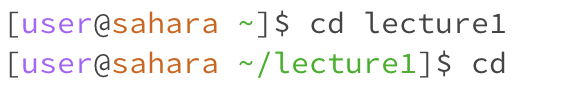

In Lab 1 of CSE15L, we learned some basic UNIX commands to work on a file. Here is some information that I learned:
1. Command Name : cd
    a. Using the command with no arguments.
       
   
       The working directory is /home
       Just writing cd takes us back to the home directory.
       This is not an error
    b. Using the command with a path to a directory as an argument.
       
   
       The working directory is /home/lecture1
       Writing the name of the directory along with cd opens the directory which can now be explored further.
       This is not an error.
    c. Using the command with a path to a file as an argument.
       
   
       The working directory is /home/lecture1
       This shows an error as cd can only open a directory and not a file.
       This is an error.
       
3. Command Name : ls
    a. Using the command with no arguments.
       
   
       The working directory is /home
       Just writing ls gives the names of the files/directories inside the working directory.
       This is not an error.
    b. Using the command with a path to a directory as an argument.
       
   
       The working directory is /home/lecture1
       Writing the name of a directory after typing ls shows us the names of all files/directories inside the current working directory.
       This is not an error.
    c. Using the command with a path to a file as an argument.
       
   
       The working directory is /home/lecture1
       Writing ls followed by a file name just displays the file name on the screen
       This is not an error.
5. Command Name : cat
    a. Using the command with no arguments.
       
   
       The working directory is /home/lecture1
       This displayed nothing and left blanks empty for me to type. I am not sure what this does but my belief is that this might have caused an error. 
    b. Using the command with a path to a directory as an argument.
       
   
       The working directory is /home/lecture1
       This shows an error as cat cannot be used to work on a directory
    c. Using the command with a path to a file as an argument.
       
   
       The working directory is /home/lecture1
       Writing the name of a file after cat command displays the text in that file.
       This is not an error.

### Extra Comments
--> I used pwd to check the working directories of the folders I was in for each of the commands. 
