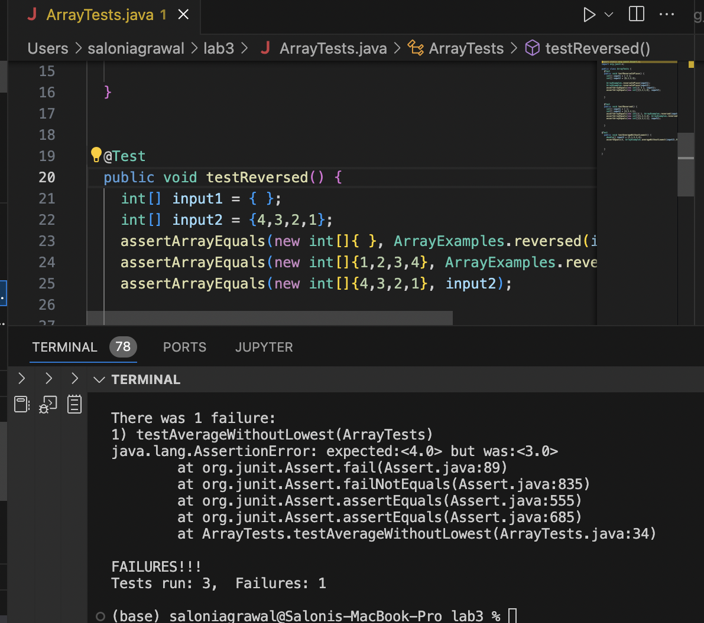
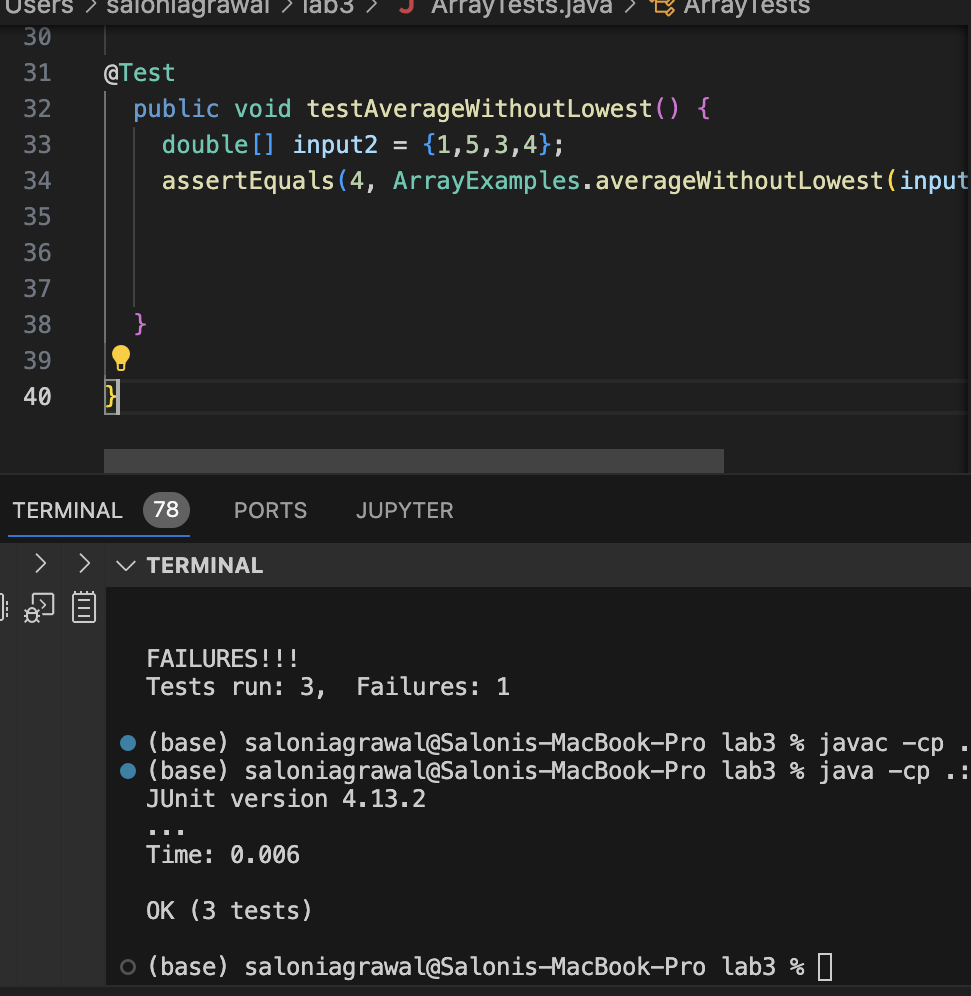
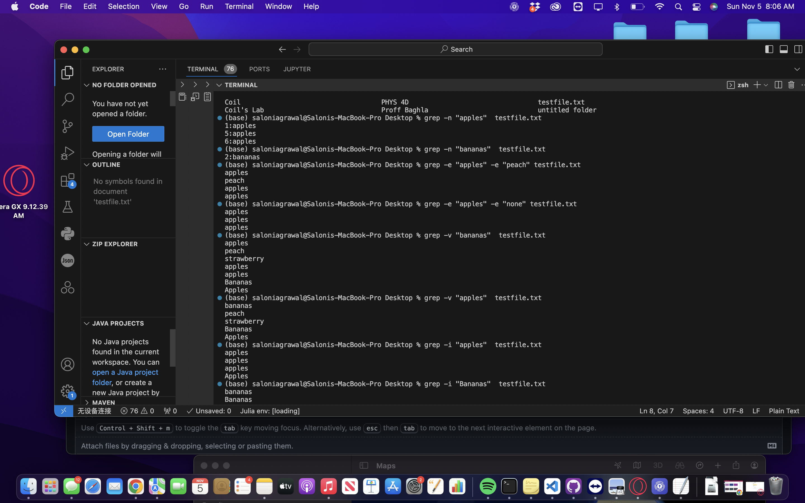
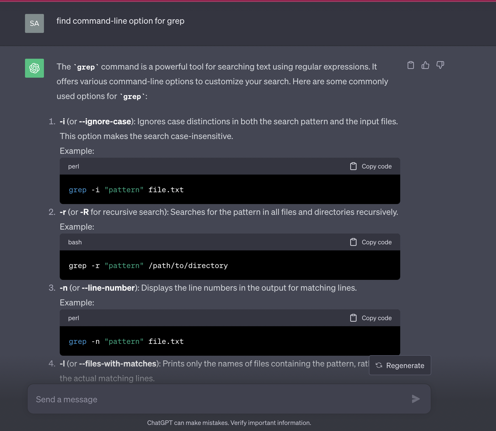

Part 1
1. Failure inducing input
   [Error in Array Examples method averageWithoutLowest]
   
    public void testAverageWithoutLowest() {
    double[] input2 = {1,1,5,3,4};
    assertEquals(4, ArrayExamples.averageWithoutLowest(input2),0);}}
   
2. Non Failure inducing input 
   [Example in Array Examples method averageWithoutLowest]
@Test
  public void testAverageWithoutLowest() {
    double[] input2 = {1,5,3,4};
    assertEquals(4, ArrayExamples.averageWithoutLowest(input2),0);}}
   
3.  
    

4. Before
  // Averages the numbers in the array (takes the mean), but leaves out the
  // lowest number when calculating. Returns 0 if there are no elements or just
  // 1 element in the array
  static double averageWithoutLowest(double[] arr) {
    if(arr.length < 2) { return 0.0; }
    double lowest = arr[0];
    for(double num: arr) {
      if(num < lowest) { lowest = num; }
    }
    double sum = 0;
    for(double num: arr) {
      if(num != lowest) { sum += num; }
    }
    return sum / (arr.length - 1);
  }

}

After Correcting    
// Averages the numbers in the array (takes the mean), but leaves out the
  // lowest number when calculating. Returns 0 if there are no elements or just
  // 1 element in the array
  static double averageWithoutLowest(double[] arr) {
    if(arr.length < 2) { return 0.0; }
    double lowest = arr[0];
    for(double num: arr) {
      if(num < lowest) { lowest = num; }
    }
    double sum = 0;
    double count = 0;
    for(double num: arr) {
      if(num != lowest) { sum += num; count +=1; }
    }
    return sum / count;
  }

}

Part 2

I chose grep
1. -n : Displays the line numbers along with the data in the lines for matching lines.
2. -e : Allows us to specify multiple patterns in a single search so that we can look for a line that contains either of the requirements
3. -v : Selects non-matching lines
4. -i : Ignores case distinctions in the pattern and input file so both upper and lower cases are considered.

I used ChatGPT for help and changed the description of each command line argument according to my my understanding

