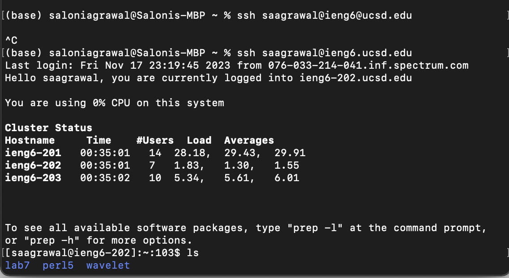
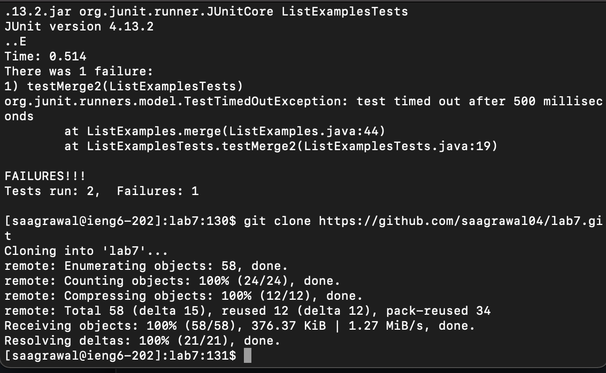
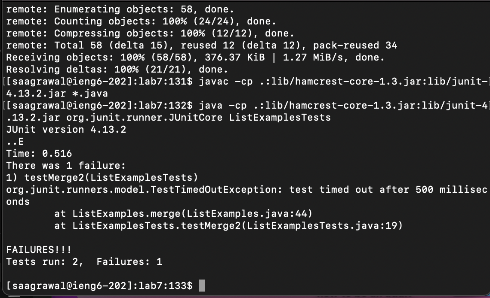
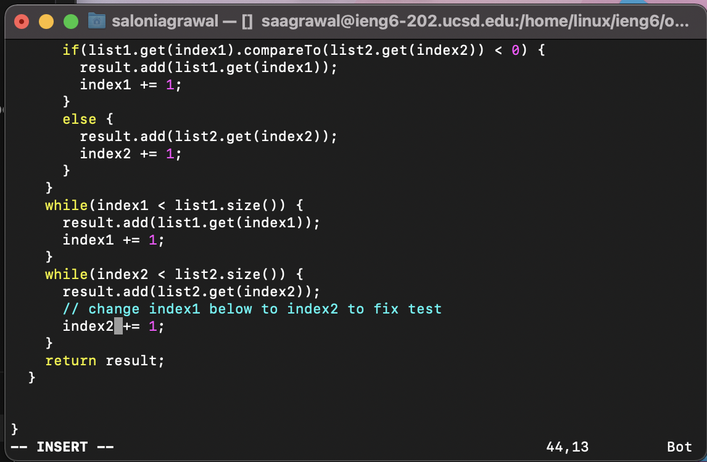
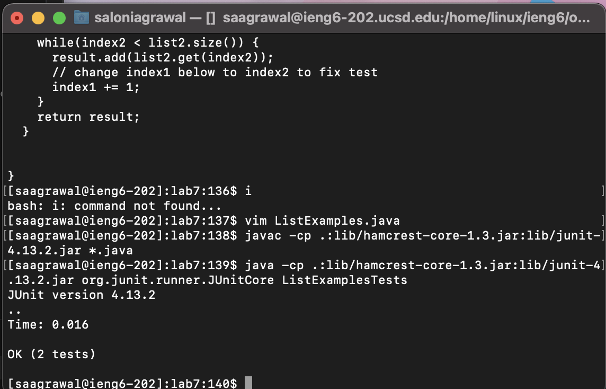
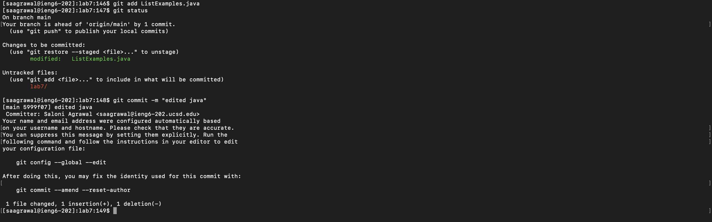

The code that I have written in angle brackets doesn't show up on Pages and hence I wasn't marked for it. To show that I have written those steps I am putting code inside -code- le brackets instead of angular

step 4 : logging into ssh

To log into ssh, I used the command : ssh saagrawal@ieng6.ucsd.edu <enter>

step 5 : cloning fork of repository from Github

To clone, I used the command : git clone https://github.com/saagrawal04/lab7.git <enter>

step 6 : Running tests to demonstrate failure

-up- -up-
-javac -cp .:lib/hamcrest-core-1.3.jar:lib/junit-4.13.2.jar *.java-
-up- -up- -up-
-java -cp .:lib/hamcrest-core-1.3.jar:lib/junit-4.13.2.jar org.junit.runner.JUnitCore ListExamplesTests-

To run the tests, I pressed -up- -up- to reach -javac -cp .:lib/hamcrest-core-1.3.jar:lib/junit-4.13.2.jar *.java- which compiles our code
Then I pressed -up- -up- -up- to reach -java -cp .:lib/hamcrest-core-1.3.jar:lib/junit-4.13.2.jar org.junit.runner.JUnitCore ListExamplesTests-
This ran the tests and showed one error

step 7 : Editing code

- vim ListExamples.java-
-down- -down- -down-...
-right- -right- -right-...
-x-
-i-
-press 1-
-Ctrl+c-
-:wq!-

To edit, I used the vim editor. I wrote -vim ListExamples.java- which opened the vim editor. I then went to the last while loop by pressing -down- -down- -down-... and changed index 1 to 2 by navigating the cursor above 1 and pressing x to delete 1. I pressed i to enter insert mode and appended 1 after index. To quit insert mode, I pressed Ctrl + c and then wrote -:wq!- to save file and exit.

step 8 : Showing test pass

I now recompile code using the same process as step 6 and this time the tests pass

step 9 : Commit and push to Github

To push, I first wrote : -git add ListExamples.java-
Then I checked status by writing : -git status-
To commit I wrote : -git commit -m "edited java"-
This commits the changes to github

