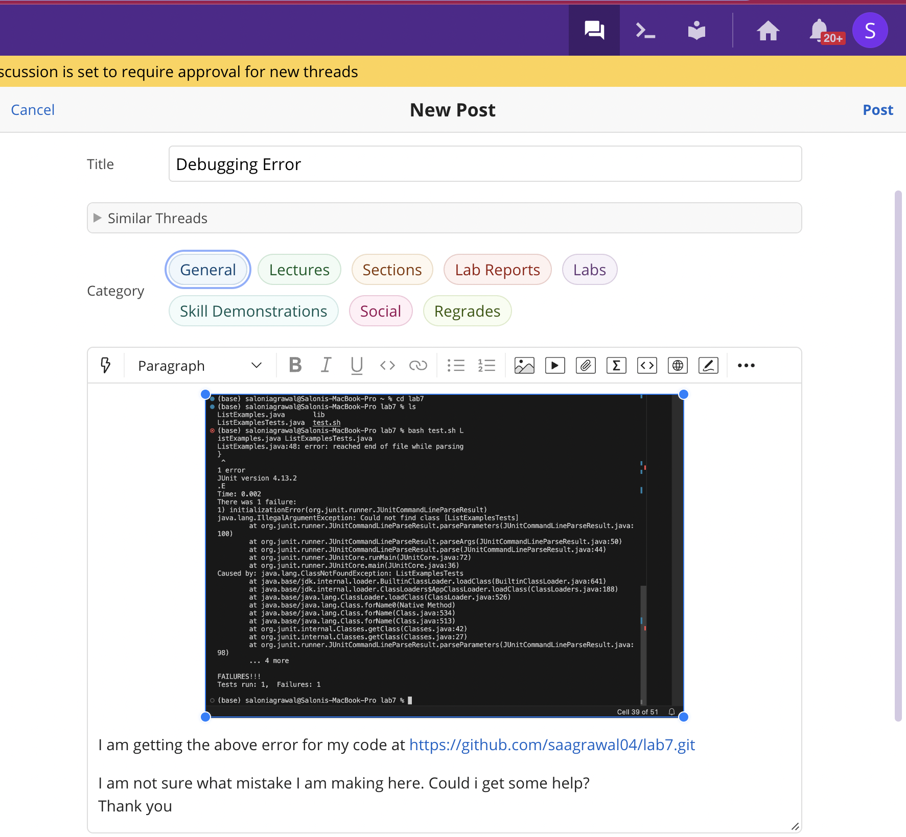
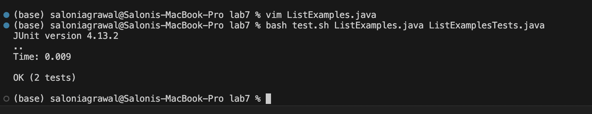

Part 1
1. 
2. TA suggestion : Your code doesnt seem to correctly handle cases where two equal strings are adjacent in list2. Take a look at the condition you have added in the last two while conditions. Think about whether you really need the if statements there?
 3. There was an error because the condition after while statements in the merge method may lead to incorrect merging of the lists, 
especially when dealing with equal strings.

4.
Directory Structure:
/Users/saloniagrawal/lab7/

Before Changing Code

#########ListExamples.java#########3
import java.util.ArrayList;
import java.util.List;

interface StringChecker { boolean checkString(String s); }

class ListExamples {

  // Returns a new list that has all the elements of the input list for which
  // the StringChecker returns true, and not the elements that return false, in
  // the same order they appeared in the input list;
  static List<String> filter(List<String> list, StringChecker sc) {
    List<String> result = new ArrayList<>();
    for(String s: list) {
      if(sc.checkString(s)) {
        result.add(0, s);
      }
    }
    return result;
  }

  // Takes two sorted list of strings (so "a" appears before "b" and so on),
  // and return a new list that has all the strings in both list in sorted order.
  static List<String> merge(List<String> list1, List<String> list2) {
    List<String> result = new ArrayList<>();
    int index1 = 0, index2 = 0;
    while(index1 < list1.size() && index2 < list2.size()) {
      if(list1.get(index1).compareTo(list2.get(index2)) < 0) {
        result.add(list1.get(index1));
        index1 += 1;
      }
      else {
        result.add(list2.get(index2));
        index2 += 1;
      }
    }
    while(index1 < list1.size()) {
     if (index2 == 0 || !list1.get(index1).equals(list1.get(index1 - 1))) {
            result.add(list1.get(index1));
        }
      index1 += 1;
    }
    while(index2 < list2.size()) {
      if (index2 == 0 || !list2.get(index2).equals(list2.get(index2 - 1))) {
            result.add(list2.get(index2));
        }
      index2 += 1;
    }
    return result;
  }
#########End###########

#########ListExamplesTests.java###########
import static org.junit.Assert.*;
import org.junit.*;
import java.util.*;
import java.util.ArrayList;

public class ListExamplesTests {
	@Test(timeout = 500)
	public void testMerge1() {
    		List<String> l1 = new ArrayList<String>(Arrays.asList("x", "y"));
		List<String> l2 = new ArrayList<String>(Arrays.asList("a", "b"));
		assertArrayEquals(new String[]{ "a", "b", "x", "y"}, ListExamples.merge(l1, l2).toArray());
	}
	
	@Test(timeout = 500)
        public void testMerge2() {
		List<String> l1 = new ArrayList<String>(Arrays.asList("a", "b", "c"));
		List<String> l2 = new ArrayList<String>(Arrays.asList("c", "d", "e"));
		assertArrayEquals(new String[]{ "a", "b", "c", "c", "d", "e" }, ListExamples.merge(l1, l2).toArray());
        }

}

########## end ############

After Changing Code

##########
import java.util.ArrayList;
import java.util.List;

interface StringChecker { boolean checkString(String s); }

class ListExamples {

  // Returns a new list that has all the elements of the input list for which
  // the StringChecker returns true, and not the elements that return false, in
  // the same order they appeared in the input list;
  static List<String> filter(List<String> list, StringChecker sc) {
    List<String> result = new ArrayList<>();
    for(String s: list) {
      if(sc.checkString(s)) {
        result.add(0, s);
      }
    }
    return result;
  }

  // Takes two sorted list of strings (so "a" appears before "b" and so on),
  // and return a new list that has all the strings in both list in sorted order.
  static List<String> merge(List<String> list1, List<String> list2) {
    List<String> result = new ArrayList<>();
    int index1 = 0, index2 = 0;
    while(index1 < list1.size() && index2 < list2.size()) {
      if(list1.get(index1).compareTo(list2.get(index2)) < 0) {
        result.add(list1.get(index1));
        index1 += 1;
      }
      else {
        result.add(list2.get(index2));
        index2 += 1;
      }
    }
    while(index1 < list1.size()) {
            result.add(list1.get(index1));
     index1 += 1;
    }
    while(index2 < list2.size()) {
     result.add(list2.get(index2));
        index2 += 1;
    }
    return result;
  }
  ########
I removed the if statements after while that were preventing addition of strings when they were common to both lists.
Part 2
The best thing I learnt in lab was bash scriptng. I recently took up a research which involves me having to regularly ssh into a remote comoputer and run some routine commands almost everyday before I work. Earlier, I was writing these commands every time which used to take a lot of redunndant work and time. After I learnt bash scripting, I created files that stored each of the sequence of commands I had to run and now I just run those files, making my work soooo much quicker.
